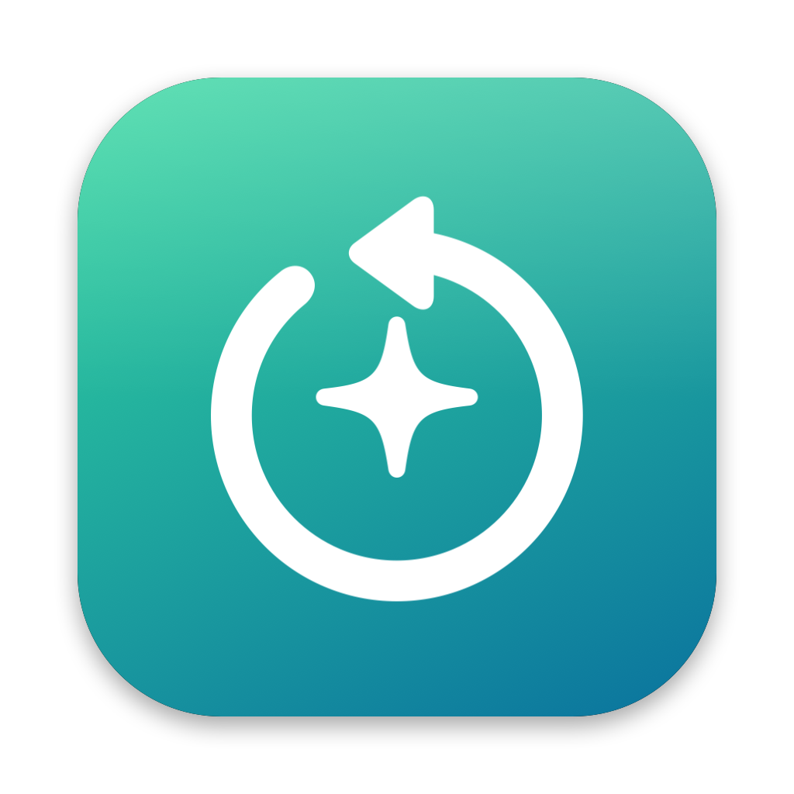

# Reclaim



A small, native macOS app that finds caches, logs and build leftovers you can safely remove.

## What it cleans

Only fixed, well-known locations in your home folder. Nothing is matched by name across the disk.

| Category | Locations | Selected by default |
|---|---|---|
| App Caches | `~/Library/Caches/*`, `~/Library/Containers/*/Data/Library/Caches/*` | Yes |
| Logs | `~/Library/Logs/*` | Yes |
| Developer Caches | Homebrew, CocoaPods, pip, Yarn, Go build, npm, Cargo | Yes (Gradle: no) |
| Xcode | Simulator caches (yes); DerivedData, Device Support, Archives (no) | Mixed |
| Unity | Per project: `Library`, `Temp`, `Obj`, `Logs`; `Build`/`Builds` go to the Trash | No |
| node_modules, CocoaPods Pods | Each project's `node_modules` / `Pods`, listed with its path | No |
| Trash, Mail Attachments | `~/.Trash`, Mail Downloads | No |

Every item is listed with its path and size and can be kept or removed on its own.

Safety rules:
- Removes what is *inside* cache and log locations, never the location itself; `node_modules`, `Pods` and Unity folders are removed whole.
- Skips caches that hold state (CloudKit, Spotlight, FontRegistry, Finder, iCloud) or are costly to rebuild (JetBrains, Playwright).
- Skips caches of apps that are running.
- Xcode Archives, Unity builds and Mail attachments go to the Trash; everything else is deleted permanently, since the Trash frees no space.
- Sizes are allocated bytes on disk with hard links counted once. APFS clones can make them an upper bound.

Grant **Full Disk Access** (System Settings → Privacy & Security) to include Trash, Mail and sandboxed app caches. Reclaim works without it and tells you what it skipped.

## Development

```bash
swift test                          # core tests
Scripts/run-gui-app.sh              # build .build/Reclaim.app and open it
Scripts/run-gui-app.sh release      # release build
swift run reclaim-cli               # read-only list of what would be cleaned
swift Scripts/make-icon.swift       # regenerate Resources/AppIcon.icns
```

Each app build records its git commit in `Info.plist` under `ReclaimGitCommit`.

## License

MIT
